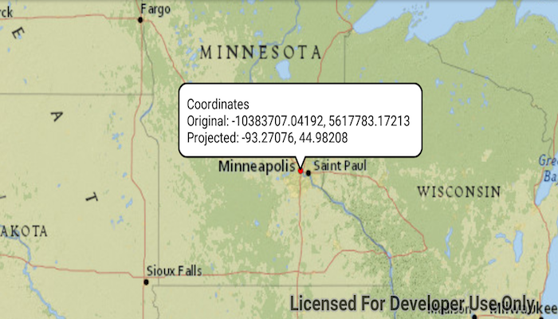

# Project

Project a point from one spatial reference to another.

## Use case

Being able to project between spatial references is fundamental to a GIS. An example of when you would need to re-project data is if you had data in two different spatial references, but wanted to perform an intersect analysis with the `GeometryEngine.intersect` function. This function takes two geometries as parameters, and both geometries must be in the same spatial reference. If they are not, you could first use `GeometryEngine.project` to convert the geometries so they match.

## How to use the sample

Tap anywhere on the map. A callout will display the tapped location's coordinate in the original (basemap's) spatial reference and in the projected spatial reference.

## How it works

1. Call the static method, `GeometryEngine.project(...)`, passing in the original `Geometry` and a `SpatialReference` to which it should be projected.

## Relevant API

* GeometryEngine
* Point
* SpatialReference

## Additional information

In cases where the output spatial reference uses a different geographic coordinate system than that of the input spatial reference, see the `GeometryEngine.project` method that additionally takes in a DatumTransformation parameter.

## Tags

coordinate system, coordinates, latitude, longitude, projected, projection, spatial reference, Web Mercator, WGS 84
