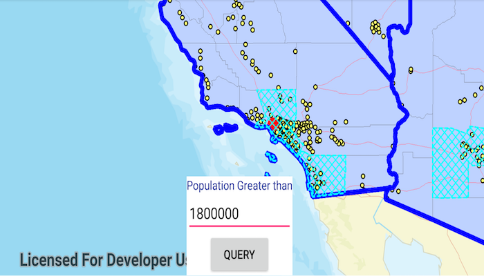

# Query Map Image Sublayer
Execute an attribute and spatial query on the sublayers of an ArcGIS map image layer.

Sublayers of an `ArcGISMapImageLayer` may expose a `ServiceFeatureTable` through a `Table` property. This allows you to perform the same queries available when working with a table from a `FeatureLayer`: attribute query, spatial query, statistics query, query for related features, and so on.

## How to use the sample
Specify a minimum population in the text box and click button to query the sublayers. After a short time, the results for each sublayer will appear as graphics.

## How it works
To query map image sublayers:
1. Create an `ArcGISMapImageLayer` using the URL of it's image service.
1. After loading the layer, get its sublayers you want to query with `(ArcGISMapImageSublayer) layer.getSubLayers().get(index)`.
1. Load the sublayer, and then get its `ServiceFeatureTable` with `sublayer.getTable()`.
1. Create `QueryParameters`. You can use the where clause to query against a table attribute or set the parameters geometry to limit the results to an area of the map.
1. Call `sublayerTable.queryFeaturesAsync(queryParameters)` to get a `FeatureQueryResult` with features matching the query.
1. Iterate through the result features to use them however you wish. 

## Relevant API
* ArcGISMapImageLayer
* ArcGISMapImageSublayer
* QueryParameters
* ServiceFeatureTable

#### Tags
Search and Query 