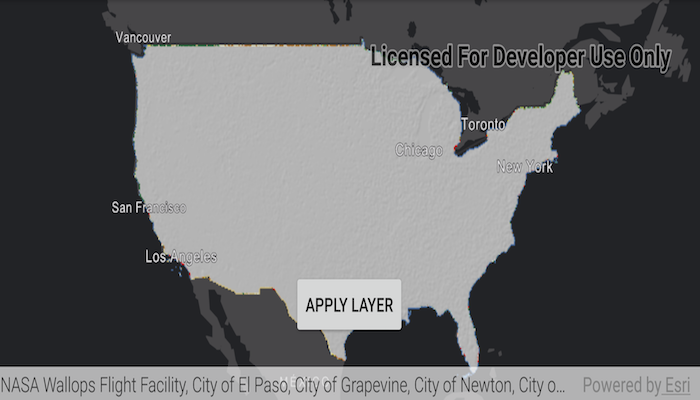

# Raster Function Service
Raster functions are operations performed on a raster to apply on-the-fly processing. This sample demonstrates how to create an image service raster and apply a hillshade raster function to it.

## How to use the sample
Click on the button to apply the Raster service

## How it works
- Create `AGSImageServiceRaster` using a `URL` and load it.
- Create `AGSRasterFunction` using a `JSON` string.
- Get raster function's arguments with `rasterFunction.arguments`
- Set image service raster in the raster function arguments with name using  `setRaster(_ raster: AGSRaster, withName name: String)`.
- Create `AGSRaster` using `AGSRasterFunction`.
- Create `AGSRasterLayer` using `AGSRaster`.
- Add `AGSRasterLayer`  to  `AGSMap.operationalLayers` array.

## Relevant API
* ImageServiceRaster
* RasterFunction
* RasterLayer

#### Tags
Layers
