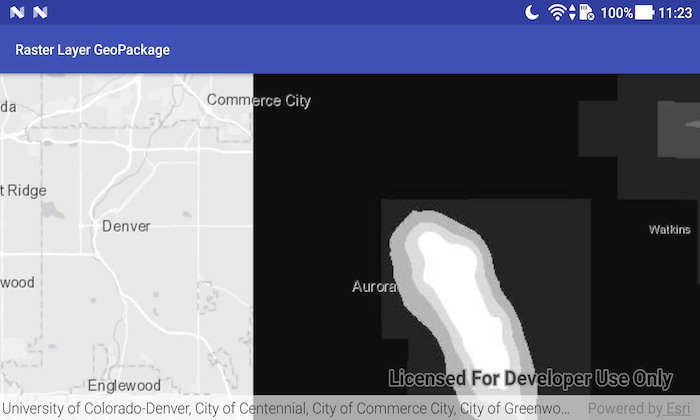

# Raster layer (GeoPackage)

Display a raster contained in a GeoPackage.

## Use case

GeoPackages are designed to simplify file management and transfer. They can store raster files (as well as other types of data). An end-user wishing to transfer rasters from ArcGIS Pro or between runtime apps might need to import raster files from GeoPackages into their map to view and analyze the data.

## How to use the sample

When the sample starts, a raster will be loaded from a GeoPackage and displayed in the map view.

## How it works

1. Create and load a `GeoPackage`, specifying the path to the local .gpkg file.
2. When it is done loading, get the `GeoPackageRaster`s from the geopackage.
3. Construct a `RasterLayer` with the geopackage raster you want to use.
4. Add the raster layer to the map.

## Relevant API

* GeoPackage
* GeoPackageRaster
* RasterLayer

## About the data

The [Aurora Colorado GeoPackage](https://www.arcgis.com/home/item.html?id=68ec42517cdd439e81b036210483e8e7) holds datasets that cover Aurora, Colorado. The raster that is opened and displayed shows airport noise levels.

## Offline data

1. Download the data from [ArcGIS Online](https://www.arcgis.com/home/item.html?id=68ec42517cdd439e81b036210483e8e7).
1. Extract the contents of the downloaded zip file to disk.
1. Open your command prompt and navigate to the folder where you extracted the contents of the data from step 1.
1. Execute the following command: `adb push AuroraCO.gpkg /sdcard/ArcGIS/Samples/GeoPackage/AuroraCO.gpkg`

Link | Local Location
---------|-------|
|[Aurora CO GeoPackage](https://www.arcgis.com/home/item.html?id=68ec42517cdd439e81b036210483e8e7)| `<sdcard>`/ArcGIS/Samples/GeoPackage/AuroraCO.gpkg|

## Tags

container, data, image, import, layer, OGC, package, raster, visualization