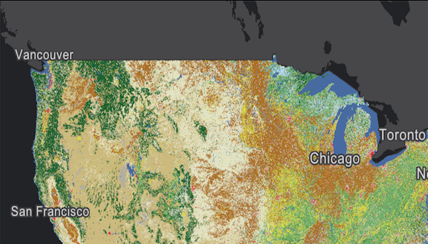

# Raster Layer Service
Create an `ImageServiceRaster` and add it to a `RasterLayer`. An `ImageServiceRaster` allows you to work with an image map service exposed by the ArcGIS Server Rest API.

## How to use the sample
Simply run the app.

## How it works
1. Create an `ImageServiceRaster` from a service url as `String`.
1. Create a `RasterLayer` from the `ImageServiceRaster`.
1. Add it as an operational layer with `map.getOperationalLayers().add(rasterLayer)`.

## Relevant API
* Raster
* RasterLayer

#### Tags
Layers