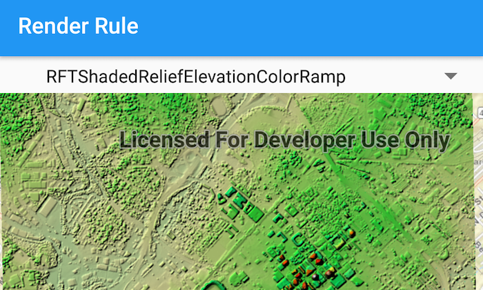

# Raster Rendering Rule
This sample demonstrates how to create an `ImageServiceRaster`, fetch the `RenderingRules` from the service info, and use a `RenderingRule` to create an `ImageServiceRaster` and add it to a raster layer. 



## Features
- ImageServiceRaster
- RasterLayer
- RenderingRule

## Developer Pattern
 When the sample starts, an `ImageServiceRaster` is created and added to a `RasterLayer`.  The `RasterLayer` is then added to the map as an operational layer.  Connect to the `loadStatusChanged` signal for the `ImageServiceRaster`. Once the `ImageServiceRaster` is loaded, the `RenderingRuleInfos` are fetched. Iterate over each item in the `RenderingRuleInfos` to get the rendering rule name and populate `List` using the names. This becomes the list for the Android `Spinner`. When an item from the spinner is selected, the `RenderingRuleInfo` for the selected index is fetched from the service info. A `RenderingRule` object is created using the `RenderingRuleInfo` and applied to a newly created `ImageServiceRaster`. The `ImageServiceRaster` is then added to the `RasterLayer`.  

```java
private void applyRenderingRule(ImageServiceRaster imageServiceRaster, int index){
    // clear all rasters
    map.getOperationalLayers().clear();
    // get the rendering rule info at the selected index
    RenderingRuleInfo renderRuleInfo = imageServiceRaster.getServiceInfo().getRenderingRuleInfos().get(index);
    // create a rendering rule object using the rendering rule info
    RenderingRule renderingRule = new RenderingRule(renderRuleInfo);
    // create a new image service raster
    ImageServiceRaster appliedImageServiceRaster = new ImageServiceRaster(getResources().getString(R.string.image_service_url));
    // apply the rendering rule
    appliedImageServiceRaster.setRenderingRule(renderingRule);
    // create a raster layer using the image service raster
    RasterLayer rasterLayer = new RasterLayer(appliedImageServiceRaster);
    // add the raster layer to the map
    map.getOperationalLayers().add(rasterLayer);
}
```
