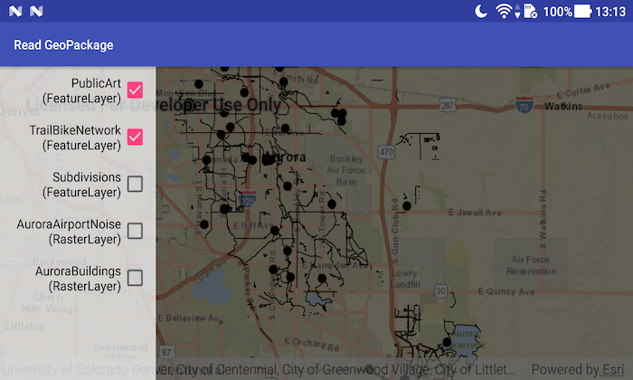

# Read GeoPackage

Add rasters and feature tables from a GeoPackage to a map.

## Use case

The OGC GeoPackage specification defines an open standard for sharing raster and vector data. You may want to use GeoPackage files to support file-based sharing of geographic data.

## How to use the sample

When the sample loads, the layers in the GeoPackage are shown in a drawer on the left side of the screen. Tap on one of these layers to add or remove it from the map.

## How it works

1. Open the `GeoPackage` with a path and load it using `geoPackage.loadAsync()`.
2. Iterate through available rasters, exposed by `geopackage.getGeoPackageRasters()`.
    * For each raster, create a new `Rasterlayer(geopackageRaster)`, then add it to the map.
3. Iterate through available feature tables, exposed by `geopackage.getGeoPackageFeatureTables()`.
    * For each feature table, create a new `FeatureLayer(geopackageFeatureTable)`, then add it to the map.

## Relevant API

* GeoPackage
* GeoPackageFeatureTable
* GeoPackageRaster

## Offline data
1. Download the data from [ArcGIS Online](https://www.arcgis.com/home/item.html?id=68ec42517cdd439e81b036210483e8e7).
1. Extract the contents of the downloaded zip file to disk.
1. Open your command prompt and navigate to the folder where you extracted the contents of the data from step 1.
1. Execute the following command: `adb push AuroraCO.gpkg /sdcard/ArcGIS/Samples/GeoPackage/AuroraCO.gpkg`

Link | Local Location
---------|-------|
|[Aurora CO GeoPackage](https://www.arcgis.com/home/item.html?id=68ec42517cdd439e81b036210483e8e7)| `<sdcard>`/ArcGIS/Samples/GeoPackage/AuroraCO.gpkg|

## About the data

This sample features a GeoPackage with datasets that cover Aurora, Colorado: Public art (points), Bike trails (lines), Subdivisions (polygons), Airport noise (raster), and liquour license density (raster).

## Additional information

GeoPackage uses a single SQLite file (.gpkg) that conforms to the OGC GeoPackage Standard. You can create a GeoPackage file (.gpkg) from your own data using the create a SQLite Database tool in ArcGIS Pro.
	
## Tags

container, layer, map, OGC, package, raster, table
