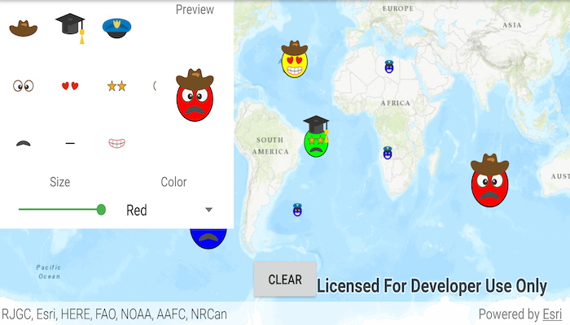

# Read symbols from a mobile style file

Combine multiple symbols from a mobile style file into a single symbol.

## Use case

You may choose to display individual elements of a dataset like a water infrastructure network (such as valves, nodes, or endpoints) with the same basic shape, but wish to modify characteristics of elements according to some technical specifications. Multilayer symbols lets you add or remove components or modify the colors to create advanced symbol styles.

## How to use the sample

Select a symbol and a color from each of the category lists to create an emoji. A preview of the symbol is updated as selections are made. The size of the symbol can be set using the slider. Tap the map to create a point graphic using the customized emoji symbol, and tap "Clear" to clear all graphics from the display.

## How it works

1. Create a new `SymbolStyle` from a stylx file, and load it.
2. Get a set of default search parameters using `symbolStyle.getDefaultSearchParametersAsync()`, and use these to retrieve a list of all symbols within the style file: `symbolStyle.searchSymbolsAsync(defaultSearchParameters)`.
3. Get the `SymbolStyleSearchResult`, which contains the symbols, as well as their names, keys, and categories.
4. Use a `List` of keys of the desired symbols to build a composite symbol using `symbolStyle.getSymbolAsync(symbolKeys)`.
5. Create a `Graphic` using the `MultilayerPointSymbol`.

## Relevant API

* MultilayerPointSymbol
* MultilayerSymbol
* SymbolLayer
* SymbolStyle
* SymbolStyleSearchParameters

## Offline Data
1. Download the data from
   [ArcGIS Online](https://arcgisruntime.maps.arcgis.com/home/item.html?id=1bd036f221f54a99abc9e46ff3511cbf).
1. Extract the contents of the downloaded zip file to disk.
1. Open your command prompt and navigate to the folder where you extracted the contents of the data from step 1.
4. Execute the following command: `adb push emoji-mobile.stylx
   /sdcard/ArcGIS/Samples/Style/emoji-mobile.stylx`

Link | Local Location
---------|-------|
|[Emoji mobile style](https://arcgisruntime.maps.arcgis.com/home/item.html?id=1bd036f221f54a99abc9e46ff3511cbf)| `<sdcard>`/ArcGIS/Samples/Style/emoji-mobile.stylx |

## Offline Data

1. Download the data from [ArcGIS Online](https://arcgisruntime.maps.arcgis.com/home/item.html?id=1bd036f221f54a99abc9e46ff3511cbf).
2. Open your command prompt and navigate to the folder where you extracted the contents of the data from step 1.
3. Push the data into the scoped storage of the sample app:
`adb push emoji-mobile.stylx /Android/data/com.esri.arcgisruntime.sample.readsymbolsmobilestylefile/files/emoji-mobile.stylx`

## About the data

The mobile style file used in this sample was created using ArcGIS Pro, and is hosted on [ArcGIS Online](https://www.arcgis.com/home/item.html?id=1bd036f221f54a99abc9e46ff3511cbf). It contains symbol layers that can be combined to create emojis.

## Additional information

While each of these symbols can be created from scratch, a more convenient workflow is to author them using ArcGIS Pro and store them in a mobile style file (.stylx). ArcGIS Runtime can read symbols from a mobile style, and you can modify and combine them as needed in your app.

## Tags

advanced symbology, mobile style, multilayer, stylx
