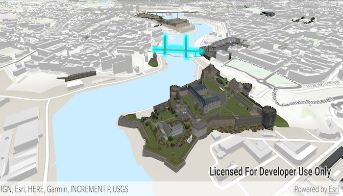

# Scene Layer Selection
Select geoelements in a scene layer.

## How to use the sample
Click on a building in the scene layer to select it. Unselect buildings by clicking away from the buildings.

## How it works
1. Create an `ArcGISSceneLayer` passing in the URL to a scene layer service.
1. Use `sceneView.setOnTouchListener` to get the screen tap location `screenPoint`.
1. Call `sceneView.identifyLayersAsync(sceneLayer, screenPoint, tolerance, false, 1)` to identify features in the scene.
1. From the resulting `IdentifyLayerResult`, get the list of identified `GeoElement`s with `result.getElements()`.
1. Get the first element in the list, checking that it is a feature, and call `sceneLayer.selectFeature(feature)` to select it.

## Relevant API
* ArcGISScene
* SceneView
* SceneLayer

#### Tags
Search and Query