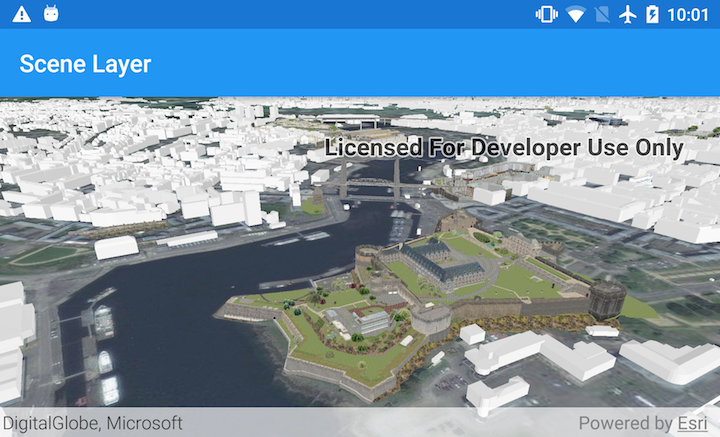

# Scene Layer
Add a scene layer to a scene.

## How to use the sample
Simply run the app.

## How it works
1. Create an `ArcGISScene` and set a `Basemap` with `ArcGISScene.setBasemap()`.
1. Create a `SceneView` and set the scene to the view with `SceneView.setScene(...)`. 
1. Create a `SceneLayer` and add it to the scene as an operational layer with `ArcGISScene.getOperationalLayers().add(sceneLayer)`.

## Relevant API
* ArcGISScene
* SceneView
* SceneLayer

#### Tags
Layers