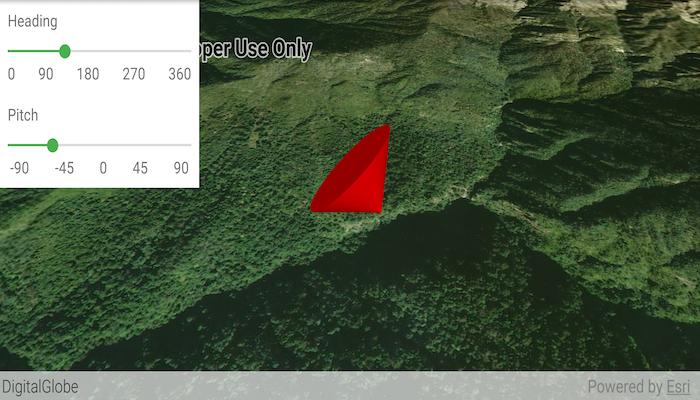

# Scene property expressions

Update the orientation of a graphic using expressions based on its attributes.

## Use case

Instead of reading the attribute and changing the rotation on the symbol for a single graphic (a manual CPU operation), you can bind the rotation to an expression that applies to the whole overlay (an automatic GPU operation). This usually results in a noticeable performance boost (smooth rotations).

## How to use the sample

Adjust the heading and pitch sliders to rotate the cone.

## How it works

1. Create a new `GraphicsOverlay`. 
2. Create a new `SimpleRenderer`.
3. Set the heading expression to `[HEADING]` and the pitch expression to `[PITCH]` with `simpleRenderer.getSceneProperties().setHeadingExpression(...)`.
4. Apply the renderer to the graphics overlay with `graphicsOverlay.setRenderer(simpleRenderer)`.
5. Create a new `Point` and a new `Graphic` and add it to the overlay with e.g. `graphicsOverlay.getGraphics().add(graphic)`.
6. To update the graphic's rotation, update the `HEADING` or `PITCH` property in the graphic's attributes with `graphic.getAttributes().put(key, value)`.
       
## Relevant API

* Graphic
* GraphicsOverlay
* SceneProperties
* SceneProperties.setHeadingExpression
* SceneProperties.setPitchExpression
* SimpleRenderer

## Tags

3D, expression, graphics, heading, pitch, rotation, scene, symbology
