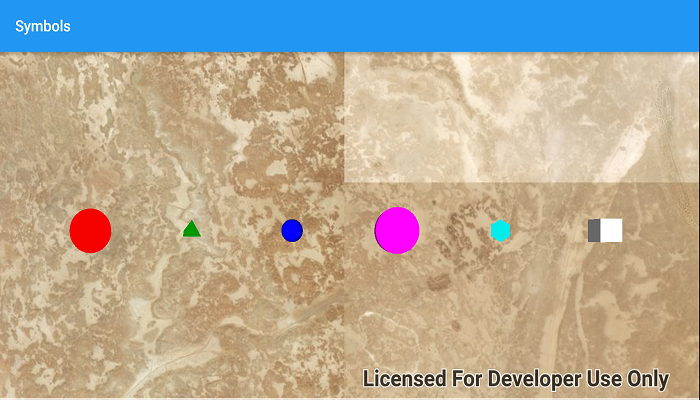

# Symbols
Create graphics with simple 3D shapes.
Includes tetrahedrons, cubes, spheres, diamonds, cylinders, and cones.

## How it works
To create a SimpleMarkerSceneSymbol with a 3D shape:

1. Create a `GraphicsOverlay`.
2. Create a `SimpleMarkerSceneSymbol(Style, color, width, height, depth, AnchorPosition)`.
    * You can also use `SimpleMarkerSceneSymbol.createCone(color, diameter, height)`
    * color, hex code color of symbol (Red = 0xFFFF0000)
    * (width, height, depth), size of the symbol
    * AnchorPosition, where to position symbol on Graphic
3. Create a graphic using the symbol, `Graphic(Geometry, Symbol)`.
4. Add the graphic to the graphics overlay, `GraphicsOverlay.getGraphics().add(Graphic)`.
5. Add the graphics overlay to the `SceneView`, `SceneView.getGraphicsOverlays().add(GraphicsOverlay)`.

## Relevant API

* ArcGISScene
* Graphic
* GraphicsOverlay
* SimpleMarkerSceneSymbol
* SimpleMarkerSceneSymbol.STYLE
* SceneSymbol.AnchorPosition

#### Tags
Maps and Scenes
