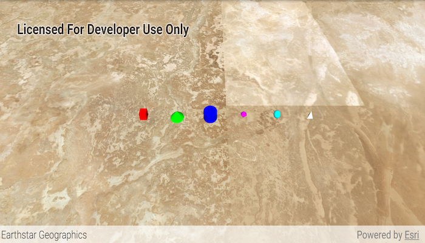

# Scene symbols

Show various kinds of 3D symbols in a scene.

## Use case

You can programmatically create different types of 3D symbols and add them to a scene at specified locations. You could do this to call attention to the prominence of a location.

## How to use the sample

When the scene loads, note the different types of 3D symbols that you can create.

## How it works

1. Create a `GraphicsOverlay`.
1. Create various simple marker scene symbols by specifying different styles and colors, and a height, width, depth, and anchor position of each.
2. Create a new `Graphic` object for each symbol.
3. Add the graphics to the graphics overlay with `graphicsOverlay.getGraphics().add(graphic)`.
4. Add the graphics overlay to the scene view with `sceneView.getGraphicsOverlays().add(graphicsOverlay)`.

## Relevant API

* Graphic
* GraphicsOverlay
* SceneSymbol.AnchorPosition
* SimpleMarkerSceneSymbol
* SimpleMarkerSceneSymbol.Style

## About the data

This sample shows arbitrary symbols in an empty scene with an imagery basemap.

## Tags

3D, cone, cube, cylinder, diamond, geometry, pyramid, scene, shape, sphere, symbol, tetrahedron, tube, visualization
