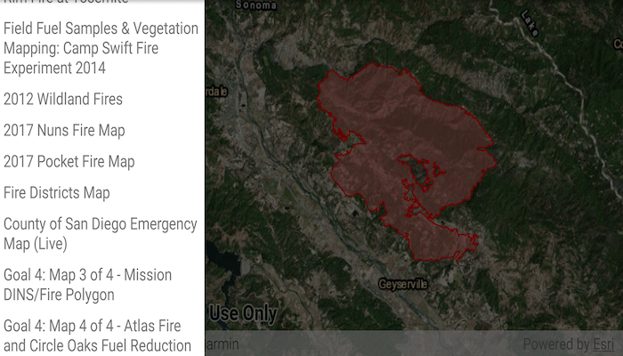

# Search for webmap

Find webmap portal items by using a search term.

## Use case

Portals can contain many portal items and at times you may wish to query the portal to find what you're looking for. In this example, we search for webmap portal items using a text search.

## How to use the sample

Enter search terms into the search bar. Once the search is complete, a list is populated with the resultant webmaps. Tap on a webmap to set it to the map view. Scrolling to the bottom of the webmap recycler view will get more results.

## How it works

1. Create a new `Portal` and load it.
2. Create new `PortalQueryParameters`. Set the type to `PortalItem.Type.WEBMAP` and add the text you want to search for.
3. Use `portal.findItemsAsync(params)` to get the first set of matching items (10 by default).
4. Get more results with `portal.findItemsAsync(portalQueryResultSet.getNextQueryParameters())`.

## Relevant API

* Portal
* PortalItem
* PortalQueryParameters
* PortalQueryResultSet

## Tags

keyword, query, search, webmap