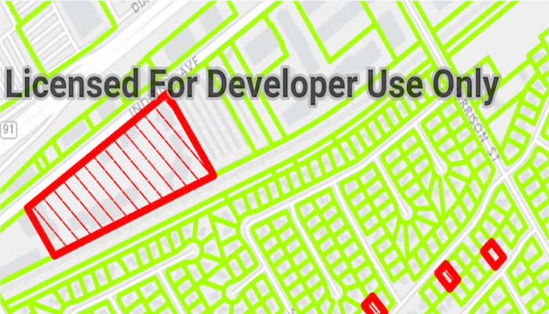

# Service feature table (cache)

Display a feature layer from a service using the **on interaction cache** feature request mode.

## Use case

Service feature tables support three request modes, which define how features are requested from the service and stored in the local table. The feature request modes have different performance characteristics. Use **On interaction cache** in scenarios with large amounts of infrequently edited data. See [Table performance concepts](https://developers.arcgis.com/android/latest/guide/layers.htm#ESRI_SECTION1_40F10593308A4718971C9A8F5FB9EC7D) in the *ArcGIS Runtime SDK for Android* guide to learn more.

## How to use the sample

Run the sample and pan and zoom around the map. With each interaction, features will be requested and stored in a local cache. Each subsequent interaction will display features from the cache and only request new features from the service.

## How it works

1. Set the `ServiceFeatureTable.setFeatureRequestMode(...)` property of the service feature table to `ON_INTERACTION_CACHE` before the table is loaded.
2. Add the table to the map using a `FeatureLayer`; features will be requested for the visible extent as the user pans and zooms.

## Relevant API

* FeatureLayer
* FeatureRequestMode.ON_INTERACTION_CACHE
* ServiceFeatureTable
* ServiceFeatureTable.setFeatureRequestMode

## About the data

The sample opens with an initial visible extent centered over pool permit statuses in California.

## Additional information

**On interaction cache** is the default feature request mode. Features are requested automatically for the visible extent as the users pans and zooms the map. If the user returns to an area where features have previously been requested, those features won't be requested again.

## Tags

cache, feature request mode, performance
