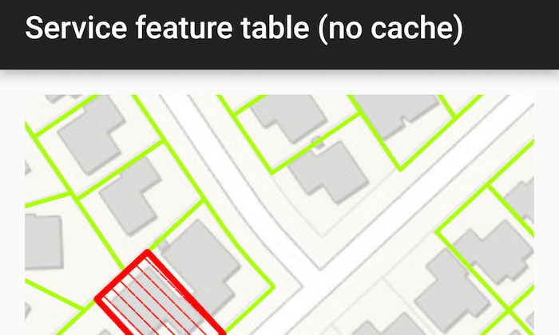

# Service Feature Table (No Cache)
Use a feature service in on-interaction-no-cache mode. This mode always fetches features from the server and does not cache features client side by setting the `ServiceFeatureTable.FeatureRequestMode` to `ON_INTERACTION_NO_CACHE` on an service feature table before it is loaded.

## How to use the sample
Simply run the app.

## How it works
Set the `ServiceFeatureTable.FeatureRequestMode` property of the service feature table to `ON_INTERACTION_NO_CACHE` before the table is loaded.

## Relevant API
* FeatureLayer
* ServiceFeatureTable
* ServiceFeatureTable.setFeatureRequestMode(...)

#### Tags
Edit and Manage Data
