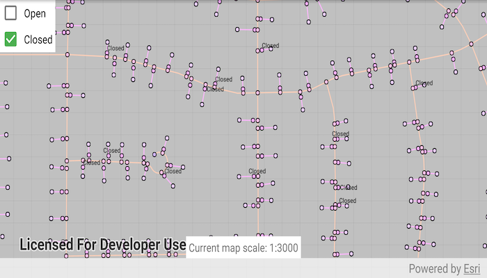

# Set annotation sublayer visibility

Use annotation sublayers to control the scales at which different annotation is visible.

## Use case

Annotation, which differs from labels by having a fixed place and size, is typically only relevant at particular scales. Annotation sublayers allow for finer control of annotation by allowing properties (like visibility) to be set on subtypes of an annotation layer. 

## How to use the sample

Start the sample and take note of the visibility of the annotation. Zoom in and out to see the annotation turn on and off based on scale ranges set on the data:
* The "Open" annotation sublayer has its minimum scale set to 1:500 and its maximum scale set to 1:1500.
* The "Closed" annotation sublayer has its minimum scale set to 1:500 and its maximum scale set to 1:5000.

Use the checkboxes to manually turn the "Open" and "Closed" annotation sublayers on and off.

## How it works

1. Load the `MobileMapPackage`.
1. Populate checkbox text with the `AnnotationSublayer` names.
1. Wire up the checkboxes to toggle the annotation sublayer's visibility.
1. On changes to map view navigation, set the current scale to the associated UI element at the bottom of the screen.
 
## Relevant API

* AnnotationLayer
* AnnotationSublayer
* LayerContent

## Offline Data
1. Download the data from [ArcGIS Online](https://arcgisruntime.maps.arcgis.com/home/item.html?id=b87307dcfb26411eb2e92e1627cb615b).
1. Extract the contents of the downloaded zip file to disk.
1. Open your command prompt and navigate to the folder where you extracted the contents of the data from step 1.
1. Execute the following command:
`adb push GasDeviceAnno.mmpk /sdcard/ArcGIS/Samples/MapPackage/GasDeviceAnno.mmpk`

Link | Local Location
---------|-------|
|[Gas Device Anno Mobile Map Package](https://arcgisruntime.maps.arcgis.com/home/item.html?id=b87307dcfb26411eb2e92e1627cb615b)| `<sdcard>`/ArcGIS/Samples/MapPackage/GasDeviceAnno.mmpk|

#### Tags
Visualization
Annotation
utilities
text
scale
