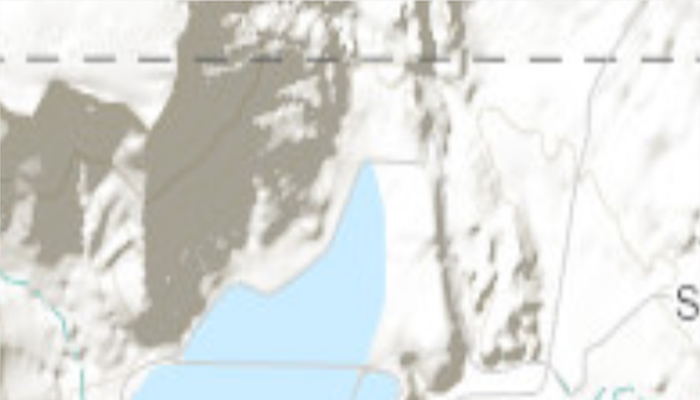

# Set initial map area

Display the map at an initial viewpoint representing a bounding geometry.

## Use case

Setting the initial viewpoint is useful when a user wishes to first load the map at a particular area of interest.

## How to use the sample

When the sample loads, note that the map is opened at the initial view point set.

## How it works

1. Instantiate an `ArcGISMap` object.
2. Instantiate a `Viewpoint` object using an `Envelope` object.
3. Set the starting location of the map with `setInitialViewpoint(Viewpoint)`.
4. Set the map to a `MapView` object.

## Relevant API

* ArcGISMap
* Envelope
* MapView
* Point
* Viewpoint

## Tags

extent, zoom
