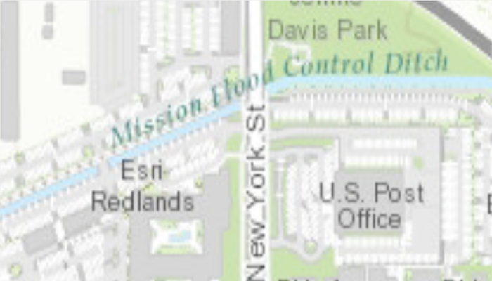

# Set initial map location

Display a basemap centered at an initial location and scale.

## Use case

You can set a map's initial location when you want to highlight a particular feature or area to establish the context.

## How to use the sample

When the map loads, note the specific location and scale of the initial map view.

## How it works

1. Create an `ArcGISMap`, specifying a basemap type, latitude and longitude in WGS84, and a level of detail.
2. Display the map in a map view with `MapView.setMap(map)`.

## Relevant API

* BasemapStyle
* Map
* MapView

## About the data

The map opens with a topographic map of Esri's headquarters in Redlands, California.

## Tags

basemap, center, envelope, extent, initial, lat, latitude, level of detail, location, LOD, long, longitude, scale, zoom level
