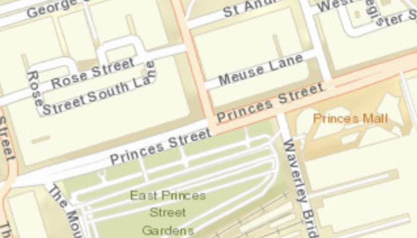

# Min max scale

Restrict zooming to a specific scale range.

## How it works

1. Create an ArcGIS map.
1. Set min and max scales of map, `ArcGISMap.setMaxScale()` and `ArcGISMap.setMinScale()`.
1. Set initial Viewpoint of map, `ArcGISMap.setInitialViewpoint()`
1. Set the ArcGIS map to the `MapView`.

## Relevant API

* ArcGISMap
* Basemap
* MapView
* Viewpoint

#### Tags

Maps and Scenes