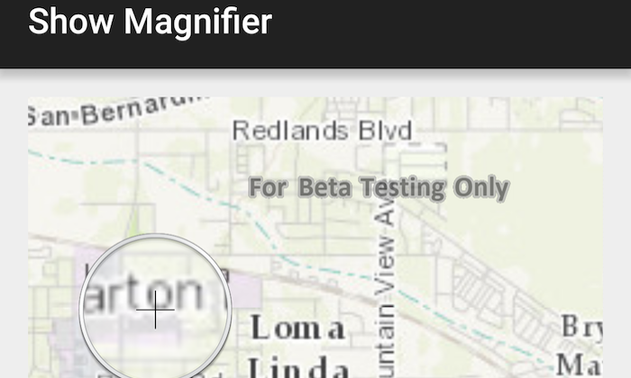

# Show magnifier

Tap and hold on a map to show a magnifier.

## Use case

Due to the limited screen size of some mobile devices, it may be difficult to identify individual features on a map where there is a high density of information, or the scale is very small. This can be the case when a mobile device is used for navigation, and the user wishes to magnify a particular area to better identify a road intersection.

## How to use the sample

Tap and hold on the map to show a magnifier, then drag across the map to move the magnifier. You can also pan the map while holding the magnifier, by dragging the magnifier to the edge of the map.

## How it works

1. Create a new `MapView`, and add an `ArcGISMap` to it using `mapView.setMap(map)`.
2. Enable the magnifier using `mapView.setMagnifierEnabled(true)`. This will set the magnifier to be shown on the map when the user performs a long press gesture. Note: The default value is `false`.
3. Optionally, use `mapView.setCanMagnifierPanMap(true)` to allow the map to be panned automatically when the magnifier gets near the edge of the map.

## Relevant API

* ArcGISMap
* MapView
* MapView.setCanMagnifierPanMap(...)
* MapView.setMagnifierEnabled(...)

## Additional information

This sample only works on a device with a touch screen. The magnifier will not appear via a mouse click.

## Tags

magnify, map, zoom
