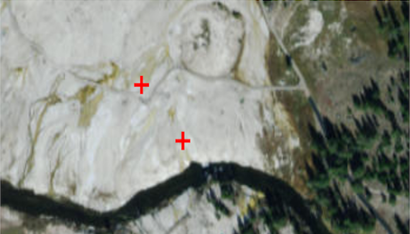

# Simple Renderer
Create a simple renderer and add it to a graphics overlay. Renderers define the symbology for all graphics in a graphics overlay (unless they are overridden by setting the symbol directly on the graphic). Simple renderers can also be defined on feature layers using the same code.

## How to use the sample
Simply run the sample.

## How it works
A simple renderer is created using a simple marker symbol (red cross) and set onto a graphics overlay. 3 points are created and added to graphics which are then added to the graphics overlay.   The graphics overlay is added to the map view so it is visible, all graphics are then styled with the same symbol that was defined in the renderer.

## Relevant API
* Graphic
* GraphicsOverlay
* SimpleMarkerSymbol
* SimpleRenderer

#### Tags
Visualization
