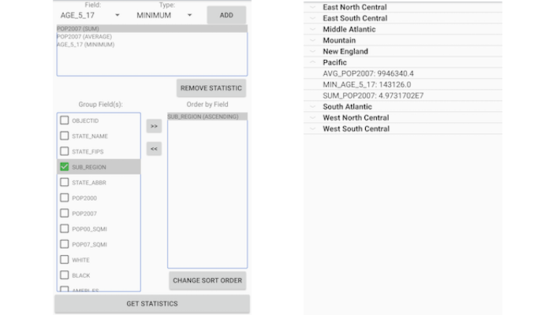

# Statistical query group and sort

Query a feature table for statistics, grouping and sorting by different fields.

## Use case

You can use statistical queries, grouping and sorting to process large amounts of data saved in feature tables. This is helpful for identifying trends and relationships within the data, which can be used to support further interpretations and decisions. For example, a health agency can use information on medical conditions occurring throughout a country to identify at-risk areas or demographics, and decide on further action and preventive measures.

## How to use the sample

The sample will start with some default options selected. You can immediately click the "Get Statistics" button to see the results for these options. There are several ways to customize your queries:

* You can add statistic definitions to the top-left table using the drop down menus and "Add" button. Select a table row and click "Remove statistic" to remove a definition.

* To change the Group-by fields, check the box by the field you want to group by in the bottom-left list view. 

* To change the Order-by fields, select a Group-by field (it must be checked) and click the ">>" button to add it to the Order-by table. To remove a field from the Order-by table, select it and click the "<<" button. To change the sort order of the Order-by field, the cells of the "Sort Order" column are combo-boxes that may be either ASCENDING or DESCENDING.

## How it works

1. Create a `ServiceFeatureTable` using the URL of a feature service and load the table.
2. Get the feature tables field names list with `featureTable.getFields()`.
3. Create `StatisticDefinition`s specifying the field to compute statistics on and the `StatisticType` to compute.
4. Create `StatisticsQueryParameters` passing in the list of statistic definitions.
5. To have the results grouped by fields, add the field names to the query parameters' `groupByFieldNames` collection.
6. To have the results ordered by fields, create `OrderBy`s, specifying the field name and `SortOrder`. Pass these `OrderBy`s to the parameters' `orderByFields` collection.
7. To execute the query, call `featureTable.queryStatisticsAsync(queryParameters)`.
8. Get the `StatisticsQueryResult`. From this, you can get an iterator of `StatisticRecord`s to loop through and display.

## About the data

This sample uses a [Diabetes, Obesity, and Inactivity by US County](https://www.arcgis.com/home/item.html?id=392420848e634079bc7d0648586e818f) feature layer hosted on ArcGIS Online.

## Relevant API

* Field
* OrderBy
* QueryParameters
* ServiceFeatureTable
* StatisticDefinition
* StatisticRecord
* StatisticsQueryParameters
* StatisticsQueryResult
* StatisticType

## Tags

correlation, data, fields, filter, group, sort, statistics, table