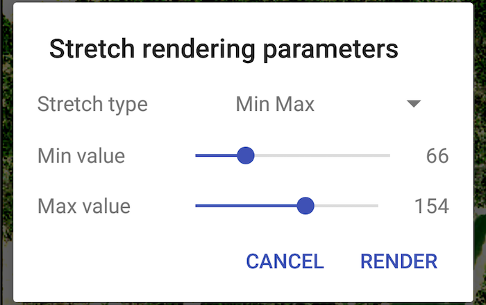

# Stretch renderer

Use a stretch renderer to enhance the visual contrast of raster data for analysis.

## Use case

An appropriate stretch renderer can enhance the contrast of raster imagery, allowing the user to control how their data is displayed for efficient imagery analysis.

## How to use the sample

Choose one of the stretch parameter types from the wrench icon in the action bar:

* Standard deviation - a linear stretch defined by the standard deviation of the pixel values
* Min-max - a linear stretch based on minimum and maximum pixel values
* Percent clip - a linear stretch between the defined percent clip minimum and percent clip maximum pixel values

Then configure the parameters and tap 'Render'.

## How it works

1. Create a `Raster` from a raster file.
2. Create a `RasterLayer` from the raster.
3. Create a `Basemap` from the raster layer with `Basemap(RasterLayer)` and set it to the map with `ArcGISMap(basemap)`.
4. Create a `StretchRenderer`, specifying the stretch parameters and other properties.
5. Set the stretch renderer on the raster layer with `rasterLayer.setRasterRenderer(stretchRenderer)`.

## Relevant API

* MinMaxStretchParameters
* PercentClipStretchParameters
* Raster
* RasterLayer
* StandardDeviationStretchParameters
* StretchParameters
* StretchRenderer

## Offline data
1. Download the **raster-file.zip** data from [ArcGIS Online](https://arcgisruntime.maps.arcgis.com/home/item.html?id=7c4c679ab06a4df19dc497f577f111bd).  
2. Extract the contents of the downloaded zip file to disk.  
3. Create an ArcGIS/samples/raster folder on your device. You can use the [Android Debug Bridge (adb)](https://developer.android.com/guide/developing/tools/adb.html) tool found in **<sdk-dir>/platform-tools**.
4. Open up a command prompt and execute the `adb shell` command to start a remote shell on your target device.
5. Navigate to your sdcard directory, e.g. `cd /sdcard/`.  
6. Create the ArcGIS/samples directory, `mkdir ArcGIS/samples/raster`.
7. You should now have the following directory on your target device, `/sdcard/ArcGIS/samples/raster`. We will copy the contents of the downloaded data into this directory. Note:  Directory may be slightly different on your device.
8. Exit the shell with the, `exit` command.
9. While still in your command prompt, navigate to the root folder where you extracted the contents of the data from step 1 and execute the following command: 
	* `adb push raster-file/. /sdcard/ArcGIS/samples/raster`

Link | Local Location
---------|-------|
|[raster-file.zip](https://arcgisruntime.maps.arcgis.com/home/item.html?id=7c4c679ab06a4df19dc497f577f111bd)| `<sdcard>`/ArcGIS/samples/raster/Shasta.tif |
	
## About the data

This sample uses a raster imagery tile of an area of forested mountainous terrain and rivers.

## Additional information

See [Stretch function](http://desktop.arcgis.com/en/arcmap/latest/manage-data/raster-and-images/stretch-function.htm) in the *ArcMap* documentation for more information about the types of stretches that can be performed.

## Tags

analysis, deviation, histogram, imagery, interpretation, min-max, percent clip, pixel, raster, stretch, symbology, visualization