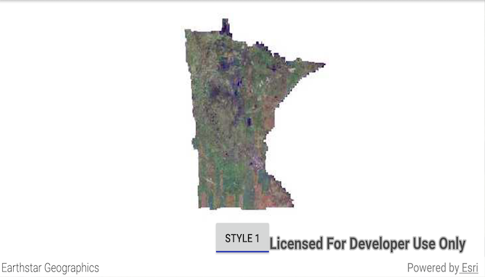

# Style WMS layer

Change the style of a Web Map Service (WMS) layer.

## Use case

Layers hosted on WMS may have different pre-set styles available to apply to them. Swapping between these styles can help during visual examination of the data. For example, increasing the contrast of satellite images can help in identifying urban and agricultural areas within forested areas.

## How to use the sample

Once the layer loads, the style button will be enabled. Tap it to toggle between the first and second styles of the WMS layer.

## How it works

1. Create a `WmsLayer` specifying the URL of the service and the layer names you want as parameters.
2. When the layer is done loading, get its list of style strings using `wmsLayer.getSublayers().get(0).getSublayerInfo().getStyles()`.
3. Set one of the styles using `wmsLayer.getSublayers().get(0).setCurrentStyle(styleString)`.

## Relevant API

* WmsLayer
* WmsSublayer
* WmsSublayerInfo

## About the data

This sample uses a public service managed by the State of Minnesota and provides composite imagery for the state and the surrounding areas.

## Tags

imagery, styles, visualization, WMS