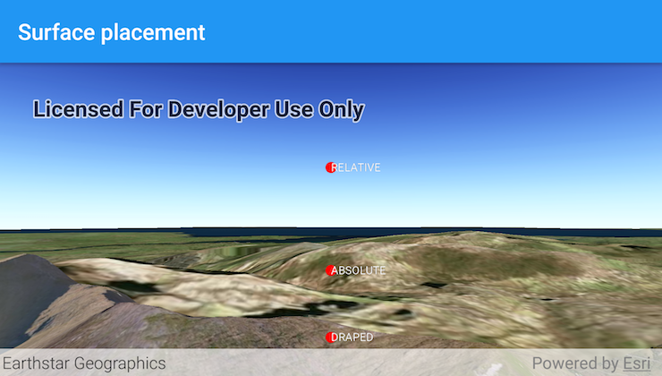

# Surface placement

Position graphics relative to a surface using different surface placement modes.

## Use case

Depending on the use case, data might be displayed at a consistent, absolute height (e.g. flight data recorded relative to sea level), at a relative height to the terrain (e.g. transmission lines positioned relative to the ground), or draped directly onto the terrain (e.g. location markers, area boundaries).

## How to use the sample

The application loads a scene showing three points that use the individual surface placement rules (Absolute, Relative, and either Draped Billboarded or Draped Flat). Use the button to change the draped mode, then explore the scene by zooming in/out and by panning around to observe the effects of the surface placement rules.

## How it works

1. Create a `GraphicsOverlay` for each placement mode, setting `LayerSceneProperties.setSurfacePlacement(...)`:
    * `ABSOLUTE`, position graphic using only its Z value.
    * `RELATIVE`, position graphic using its Z value plus the elevation of the surface.
    * `DRAPED_BILLBOARDED`, position graphic upright on the surface and always facing the camera, not using its z value.
    * `DRAPED_FLAT`, position graphic flat on the surface, not using its z value.
2. Add graphics to the graphics overlay, `GraphicsOverlay.getGraphics().add(graphic)`.
3. Add each graphics overlay to the scene view by calling `SceneView.getGraphicsOverlays().add(overlay)`.

## Relevant API

* Graphic
* GraphicsOverlay
* LayerSceneProperties.SurfacePlacement
* SceneProperties
* Surface

## About the data

The scene launches with a view of northern Snowdonia National Park. Three points are shown hovering with positions defined by each of the different surface placement modes.

## Additional information

This sample uses an elevation service to add elevation/terrain to the scene. Graphics are positioned relative to that surface for the `DRAPED_BILLBOARDED`, `DRAPED_FLAT`, `ABSOLUTE` and `RELATIVE` surface placement modes. 

## Tags

3D, absolute, altitude, draped, elevation, floating, relative, scenes, sea level, surface placement
