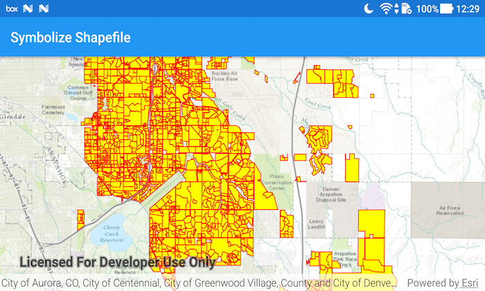

# Symbolize a Shapefile
Override the default renderer of a shapefile when displaying with a FeatureLayer.



## How to use the sample
Simply run the app.

## How it works
1. Create a `ShapefileFeatureTable` by setting the path to a shapefile. 
1. Create a `FeatureLayer` and set the feature layer table property to the `ShapeFileFeatureTable`.
1. Create a `SimpleRenderer` to override the default symbology. In this case, a yellow `SimpleFillSymbol` with a red `SimpleLineSymbol` as an outline.
1. Apply the symbol to the `FeatureLayer` by setting the renderer.

## Relevant API
* FeatureLayer
* ShapefileFeatureTable
* SimpleRenderer
* SimpleFillSymbol
* SimpleLineSymbol

## Offline data
1. Download the data from [ArcGIS Online](https://www.arcgis.com/home/item.html?id=d98b3e5293834c5f852f13c569930caa).  
1. Extract the contents of the downloaded zip file to disk.  
1. Open your command prompt and navigate to the folder where you extracted the contents of the data from step 1.
1. Execute the following command: ```adb push Aurora_CO_shp /sdcard/ArcGIS/Samples/Shapefile/Aurora_CO_shp```

Link | Local Location
---------|-------|
|[Aurora Subdivisions Shapefile](https://www.arcgis.com/home/item.html?id=d98b3e5293834c5f852f13c569930caa)| `<sdcard>`/ArcGIS/Samples/Shapefile/Aurora_CO_shp/Subdivisions.shp |

#### Tags
Visualization