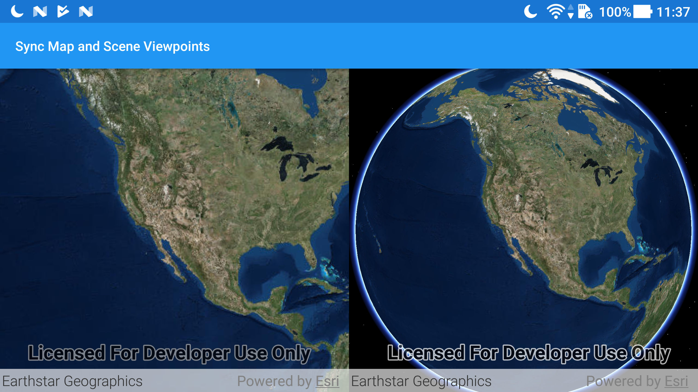

# Sync map and scene viewpoints

Keep the view points of two views (e.g. MapView and SceneView) synchronized with each other.

## Use case

You might need to synchronize GeoView viewpoints if you had two map views in one application - a main map and an inset. An inset map view could display all the layers at their full extent and contain a hollow rectangular graphic that represents the visible extent of the main map view. As you zoom or pan in the main map view, the extent graphic in the inset map would adjust accordingly.

## How to use the sample

Interact with the MapView or SceneView by zooming or panning. The other MapView or SceneView will automatically focus on the same viewpoint.

## How it works

1. Wire up the `ViewpointChanged` event handler for both geo views.
2. In each event handler, get the current viewpoint from the geo view that is being interacted with and then set the viewpoint of the other geo view to the same value.

## Relevant API

* GeoView
* MapView
* SceneView

## About the data

This application provides two different perspectives of the Imagery basemap. A 2D MapView as well as a 3D SceneView, displayed side by side.

## Tags

3D, automatic refresh, event, event handler, events, extent, interaction, interactions, pan, sync, synchronize, zoom