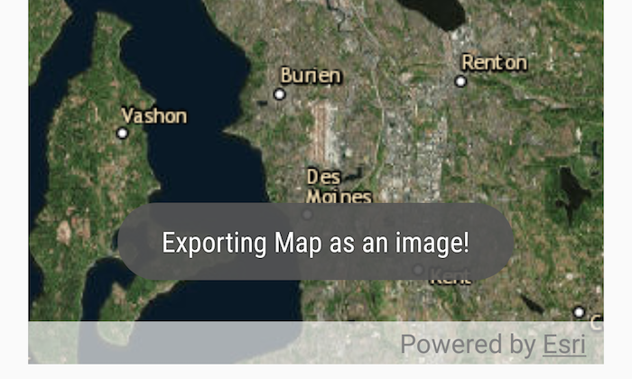

# Take screenshot

Take a screenshot of the map.

## How to use the sample

Pan and zoom to find an interesting location, then tap the camera icon to take a screenshot. The screenshot will be displayed. Note that there may be a small delay if the map is still rendering when you push the button.

## How it works

1. Wait for the map view to finish rendering the map.
2. Call `mapView.exportImageAsync()` and set it to a `ListenableFuture<Bitmap>`.
3. On done, call `get()` on the `ListenableFuture<Bitmap>` and save it to the device.

## Relevant API

* MapView
* MapView.exportImageAsync

## Tags

capture, export, image, print, screen capture, screenshot, share, shot