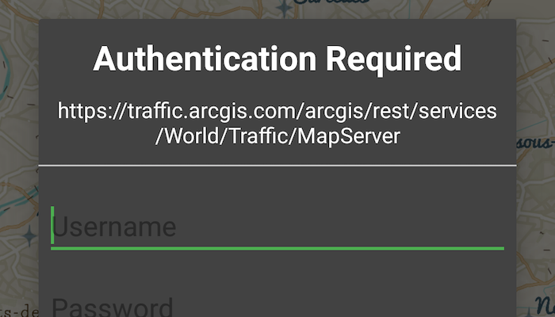

# Token authentication

This sample demonstrates how to access a web map that is secured with ArcGIS token-based authentication.

## How to use the sample

1. Once you launch the app, you will be challenged for an ArcGIS Online login to view the protected map service.
1. Enter a user name and password for an ArcGIS Online named user account (such as your ArcGIS for Developers account).
1. If you authenticate successfully, the protected map service will display in the map.

## How it works

1. Create an `AuthenticationChallengeHandler` using the `DefaultAuthenticationChallengeHandler` to handle the challenges sent by the protected map service.
1. Set the `AuthenticationChallengeHandler` used by the `AuthenticationManager`.
1. Create a `Portal` to ArcGIS Online.
1. Create a `PortalItem` for the protected web map using the `Portal` and Item ID of the protected map service.
1. Create a map to display in the `MapView` using the `PortalItem`.
1. Set the map to display in the `MapView`.

## Relevant API

* AuthenticationManager
* AuthenticationChallengeHandler
* DefaultAuthenticationChallengeHandler
* Portal
* PortalItem
* Map
* MapView

#### Tags
Cloud & Portal
Authentication
Security
