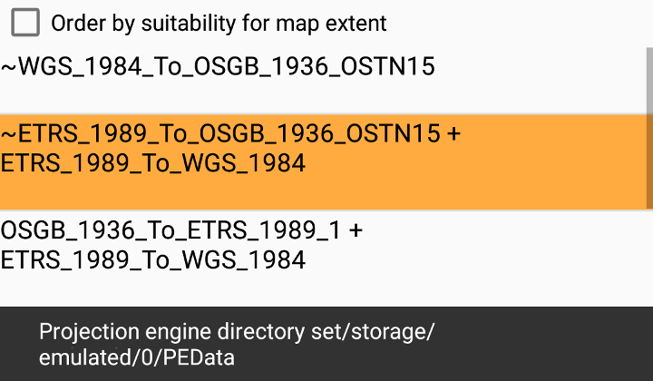

# Transforms by suitability

Get a list of suitable transformations for projecting a geometry between two spatial references with different horizontal datums.

## Use case

Transformations (sometimes known as datum or geographic transformations) are used when projecting data from one spatial reference to another when there is a difference in the underlying datum of the spatial references. Transformations can be mathematically defined by specific equations (equation-based transformations), or may rely on external supporting files (grid-based transformations). Choosing the most appropriate transformation for a situation can ensure the best possible accuracy for this operation. Some users familiar with transformations may wish to control which transformation is used in an operation.

## How to use the sample

Check the checkbox to order the list of transformations by suitability for the map extent, if desired. Select a transformation from the list to see the result of projecting the point from EPSG:27700 to EPSG:3857 using that transformation. The result is shown as a red cross; you can visually compare the original blue point with the projected red cross. If the selected transformation is not usable (has missing grid files) then an error is displayed.

## How it works

1. Pass the input and output spatial references to `TransformationCatalog.getTransformationsBySuitability` for transformations based on the map's spatial reference OR additionally provide an extent argument to only return transformations suitable to the extent. This returns a list of ranked transformations.
2. Use one of the `DatumTransformation` objects returned to project the input geometry to the output spatial reference.

## Relevant API

* DatumTransformation
* GeographicTransformation
* GeographicTransformationStep
* GeometryEngine
* GeometryEngine.Project
* TransformationCatalog

## Offline data

To download projection engine data to your device:
1. Log in to the ArcGIS for Developers site using your Developer account.
2. In the Dashboard page, click 'Download APIs and SDKs'.
3. Click the download button next to 'ArcGIS_Runtime_Coordinate_System_Data' to download projection engine data to your computer.
4. Unzip the downloaded data on your computer.
3. Create an `ArcGIS/samples/PEData` directory on your device and copy the files to this directory.

You can use the [Android Debug Bridge (adb)](https://developer.android.com/guide/developing/tools/adb.html) tool found in **<sdk-dir>/platform-tools** to copy files to your device:
1. Open a command prompt on your computer.
2. Execute the `adb push` command to create the `ArcGIS/samples/PEData` directory and copy the files from your computer to the device:
	* `adb push <path to PEData directory on your computer> /sdcard/ArcGIS/samples/PEData`

You should now have the following directory containing projection engine data files on your target device:
  * `/sdcard/ArcGIS/samples/PEData`
## Offline Data

1. To use the Projection Engine in ArcGIS Runtime, extra resources are required. Download the data [Projection Engine Data](https://developers.arcgis.com/downloads/data) from ArcGIS for Developers.
2. Extract the contents of the downloaded zip file to disk.
3. Open your command prompt and navigate to the folder where you extracted the contents of the data from step 2.
4. Push the data into the scoped storage of the sample app:
`adb push PEDataRuntime /Android/data/com.esri.arcgisruntime.sample.transformsbysuitability/files/PEDataRuntime`

## Additional information

Some transformations aren't available until transformation data is provided.

This sample can be used with or without provisioning projection engine data to your device. If you do not provision data, a limited number of transformations will be available.

## About the data

The map starts out zoomed into the grounds of the Royal Observatory, Greenwich. The initial point is in the [British National Grid](https://epsg.io/27700) spatial reference, which was created by the United Kingdom Ordnance Survey. The spatial reference after projection is in [web mercator](https://epsg.io/3857).

## Tags

datum, geodesy, projection, spatial reference, transformation
