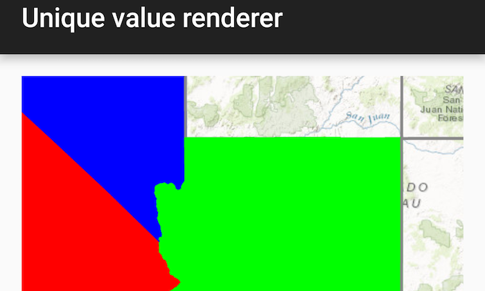

# Unique value renderer

Render features in a layer using a distinct symbol for each unique attribute value.

## Use case

A unique value renderer allows you to symbolize features in a layer based on one or more matching attributes. This is typically done by using unique colors, fill styles, or images to represent features with equal values in a string field. A unique value renderer could be used to show different types of trees on a vegetation map by using a symbols corresponding to matching name attributes.

## How to use the sample

The map with the symbolized feature layer will be shown automatically when the sample loads.

## How it works

1. Define a `SimpleFillSymbol` for each type of feature.
2. Apply the `SimpleFillSymbol` to polygon features, which is the type of feature contained by this `ServiceFeatureTable`.
3. Create separate `UniqueValue` objects which define the values in the renderer field and the symbol used to render matching features.
4. Create a default symbol to render all features that do not match any of the `UniqueValue` objects defined.

## Relevant API

* FeatureLayer
* ServiceFeatureTable
* SimpleFillSymbol
* SimpleLineSymbol
* UniqueValue
* UniqueValueRenderer

## Additional information

Using the `UniqueValueRenderer`, separate symbols can be used to display features that have a specific value for a given field. In this case, the field is subregions of the USA. While multiple fields can be used, this sample only uses one.

## About the data

The map shows U.S. states symbolized by subregion. Symbols are defined for *Pacific*, *Mountain*, and *West South Central* states. All other features are symbolized with the default symbol.

## Tags

draw, renderer, symbol, symbology, values
