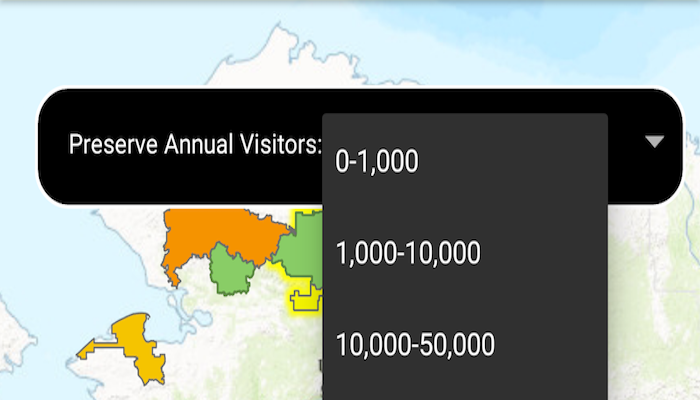

# Update related features

Update related features in an online feature service.

## Use case

Updating related features is a helpful workflow when you have two features with shared or dependent attributes. In a data collection scenario where origin tree features are related to destination inspection records, trees might undergo inspection on some regular interval to assess their size, health, and other characteristics. When logging a new inspection record that captures the latest trunk diameter and condition of a tree, updating these attributes on the origin tree feature would permit the tree point to be symbolized most accurately according to these latest observations.

## How to use the sample

Once you launch the app, select a national park feature. The app will then identify it, perform a related table query, and will show you the annual visitors amount for the preserve. You can then update the visitor amount by tapping the drop-down in the `Callout` and selecting a different amount.

## How it works

1. Create two `ServiceFeatureTable`s from the Feature Service URLs.
2. Create two `FeatureLayer`s using the previously created service feature tables.
3. Add these feature layers to the map.
4. When a `Feature` is selected, identify and highlight the selected feature.
5. Retrieve related features by calling `serviceFeatureTable.queryRelatedFeaturesAsync()` and passing in the selected feature.
6. Update feature in the feature table with `serviceFeatureTable.updateFeatureAsync(selectedFeature)` and apply updates to the server using  `serviceFeatureTable.applyEditsAsync()`.

## Relevant API

* ArcGISFeature
* RelatedFeatureQueryResult
* ServiceFeatureTable

## About the data

The map opens to a view of the State of Alaska. Two related feature layers are loaded to the map and display the Alaska National Parks and Preserves.

## Additional information

All the tables participating in a relationship must be present in the data source. ArcGIS Runtime supports related tables in the following data sources:

* ArcGIS feature service
* ArcGIS map service
* Geodatabase downloaded from a feature service
* Geodatabase in a mobile map package

## Tags

editing, features, service, updating
