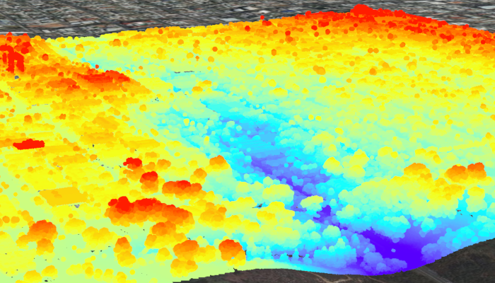

# View point cloud data offline

Display local 3D point cloud data.

## Use case

Point clouds are often used to visualize massive sets of sensor data such as lidar. The point locations indicate where the sensor data was measured spatially, and the color or size of the points indicate the measured/derived value of the sensor reading. In the case of lidar, the color of the visualized point could be the color of the reflected light, so that the point cloud forms a true color 3D image of the area.

Point clouds can be loaded offline from scene layer packages (.slpk).

## How to use the sample

The sample starts with a point cloud layer loaded and draped on top of a scene. Pan and zoom to explore the scene and see the detail of the point cloud layer.

## How it works

1. Create a `PointCloudLayer` with the path to a local `.slpk` file containing a point cloud layer.
2. Add the layer to a scene's operational layers collection with `getOperationalLayers().add(pointCloudLayer)`.

## Relevant API

* PointCloudLayer

## About the data

This point cloud data comes from Balboa Park in San Diego, California. Created and provided by USGS.

## Offline Data

1. Download the data from [ArcGIS Online](https://www.arcgis.com/home/item.html?id=34da965ca51d4c68aa9b3a38edb29e00).
2. Open your command prompt and navigate to the folder where you extracted the contents of the data from step 1.
3. Push the data into the scoped storage of the sample app:
`adb push sandiego-north-balboa-pointcloud.slpk /Android/data/com.esri.arcgisruntime.sample.viewpointclouddataoffline/files/sandiego-north-balboa-pointcloud.slpk`

## Tags

3D, lidar, point cloud
