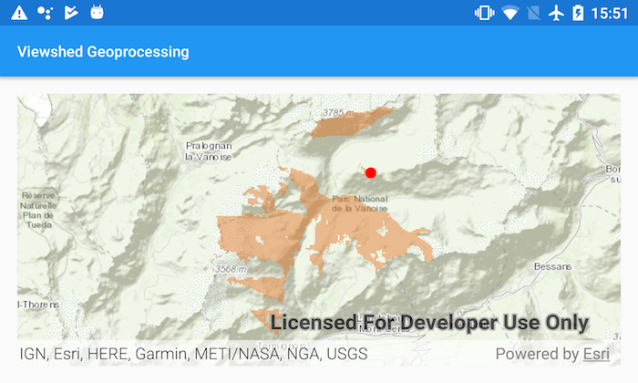

# Viewshed Geoprocessing

This sample demonstrates how to calculate a viewshed using a geoprocessing service.

## Features
* FeatureCollectionTable
* GeoprocessingJob
* GeoprocessingTask

## How to use the sample

Tap anywhere on the map to see all areas that are visible within 15 kilometers radius.

## How it works

1. Create a  `GeoprocessingTask` with the URL set to the REST endpoint of a geoprocessing service.
1. Once the graphic is added to the Map, a `FeatureCollectionTable` is created, a new `Feature` is added from the graphic's location into the `FeatureCollectionTable`, and new `GeoprocessingParameter`s are created using the featureCollectionTable.
1. Next, a `GeoprocessingJob` is created from the `GeoprocessingTask` by passing in parameters.
1. Once the job completes successfully, a `FeatureSet` is obtained from the `GeoprocessingResult`, and the features from the `FeatureSet` are added to a `GraphicsOverlay`.
