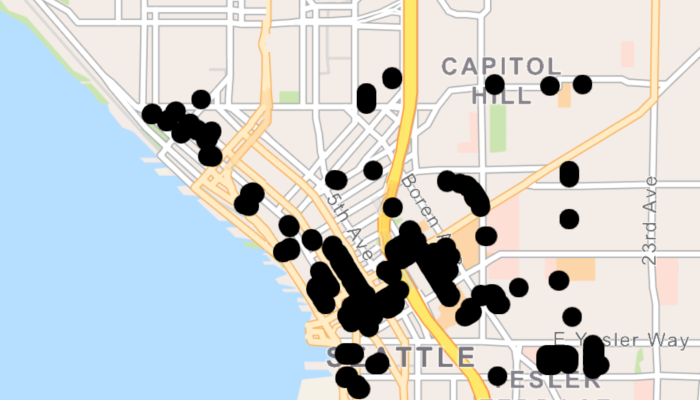

# WFS XML query

Load a WFS feature table using an XML query.

## Use case

Runtime `QueryParameters` objects can't represent all possible queries that can be made against a WFS feature service. For example, Runtime query parameters don't support wildcard searches. You can provide queries as raw XML strings, allowing you to access query functionality not available with `QueryParameters`.

## How to use the sample

Run the sample and view the data loaded from the the WFS feature table.

## How it works

1. Create a `WfsFeatureTable` and a `FeatureLayer` to visualize the table.
2. Set the feature request mode to `ManualCache`. 
3. Call `populateFromServiceAsync()` to populate the table with only those features returned by the XML query.

## Relevant API

* FeatureLayer
* WfsFeatureTable
* WfsFeatureTable.setAxisOrder()
* WfsFeatureTable.populateFromServiceAsync()

## About the data

This service shows trees in downtown Seattle and the surrounding area. An XML-encoded `GetFeature` request is used to limit results to only trees of the genus *Tilia*.

For additional information, see the underlying service on [ArcGIS Online](https://arcgisruntime.maps.arcgis.com/home/item.html?id=1b81d35c5b0942678140efc29bc25391).

## Tags

feature, OGC, query, service, web, WFS, XML
