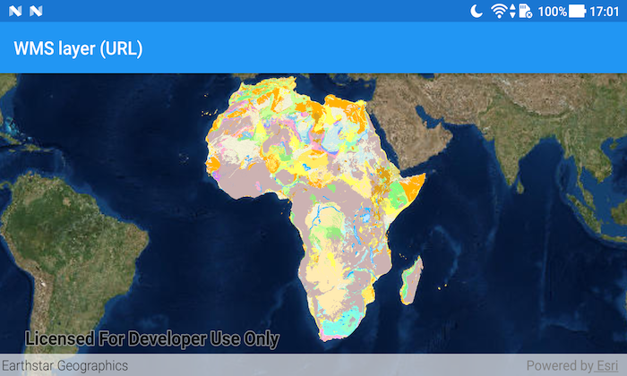

# WMS layer (URL)

This sample demonstrates how to display a WMS Layer from an online URL.

## How it works
A `WmsLayer` is constructed by setting the URL and layerNames parameters. The URL must be the URL to the "GetCapabilities" endpoint of the WMS Service. Alternatively, the layer could be constructed by setting the layerInfos parameter.

NOTE: The Web Map Service (WMS) in this sample is managed by the United States Geological Survey (USGS). ESRI, has no control over service uptime.

## Features
* WmsLayer
* Map
* MapView