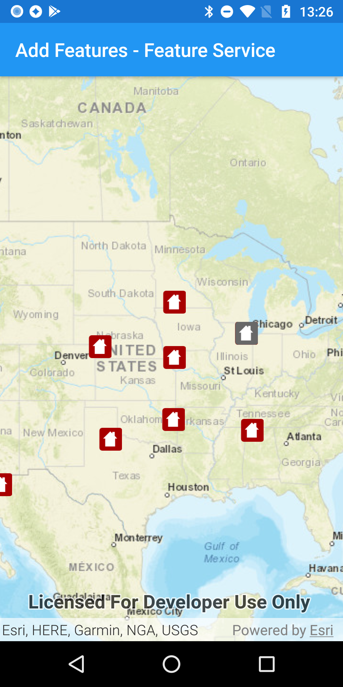

# Add features

Add features to a feature layer.

## Use case

An end-user performing a survey may want to add features to the map during the course of their work.

## How to use the sample

Tap on a location on the map to add a feature at that location.

## How it works

A `Feature` instance is added to a `ServiceFeatureTable` which then pushes that new feature to the server.

1. Create a `ServiceFeatureTable` from a URL.
2. Create a `FeatureLayer` derived from the `ServiceFeatureTable` instance.
3. Create a `Feature` with attributes and a location using the `ServiceFeatureTable`.
4. Add the `Feature` to the `ServiceFeatureTable`.
5. *Apply edits* to the `ServiceFeatureTable` which will upload the new feature to the online service.

## Relevant API

* Feature
* FeatureEditResult
* FeatureLayer
* ServiceFeatureTable

## Tags

edit, feature, online service
