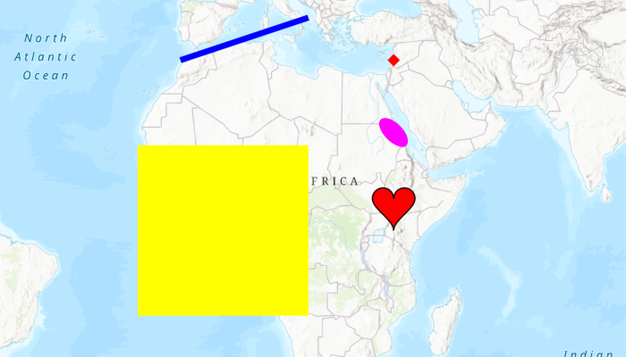

# Add Graphics Renderer



The **Add Graphics Renderer** sample demonstrates how to add graphics to a List, create a `SimpleRenderer` to represent a symbol and style, and add the renderer to the `MapView`.

## Features
* MapView
* Graphic
* GraphicsOverlay
* ListenableList
* SimpleRenderer
* SimpleMarkerSymbol

## Developer Pattern
Graphics are added to a `GraphicsOverlay` without any symbols or styles. You create a `Renderer` to add to the `GraphicsOverlay` which defines the symbol as `SimpleMarkerSymbol` which sets the style to be rendered.

```kotlin
    // add graphics overlays to the map view
    mapView.graphicsOverlays.apply {
      // add a point graphic overlay to the map view
      add(GraphicsOverlay().apply {
        // create red diamond simple renderer
        renderer = SimpleRenderer(SimpleMarkerSymbol(SimpleMarkerSymbol.Style.DIAMOND, Color.RED, 10f))
        // define point geometry
        graphics.add(Graphic(Point(40e5, 40e5, SpatialReferences.getWebMercator())))
      })

      // add a line graphic overlay to the map view
      add(GraphicsOverlay().apply {
        // create blue line simple renderer
        renderer = SimpleRenderer(SimpleLineSymbol(SimpleLineSymbol.Style.SOLID, Color.BLUE, 5f))
        // define line geometry
        graphics.add(Graphic(PolylineBuilder(SpatialReferences.getWebMercator()).apply {
          addPoint(-10e5, 40e5)
          addPoint(20e5, 50e5)
        }.toGeometry()))
      })

      // add a polygon graphic overlay to the map view
      add(GraphicsOverlay().apply {
        // create yellow fill simple renderer
        renderer = SimpleRenderer(SimpleFillSymbol(SimpleFillSymbol.Style.SOLID, Color.YELLOW, null))
        // define polygon geometry
        graphics.add(Graphic(PolygonBuilder(SpatialReferences.getWebMercator()).apply {
          addPoint(-20e5, 20e5)
          addPoint(20e5, 20e5)
          addPoint(20e5, -20e5)
          addPoint(-20e5, -20e5)
        }.toGeometry()))
      })
    }
```
