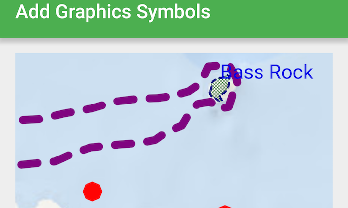

# Add Graphics with Symbols
The **Add Graphics with Symbols** sample demonstrates how to add points, polylines, and polygons as graphics, set a symbol renderer to the graphics and add to a `GraphicsOverlay`.  The sample also adds `TextSymbol` to represent text as symbols on the `GraphicsOverlay`.



## Features
* MapView
* Graphic
* GraphicsOverlay
* Point
* PointCollection
* Polygon
* Polyline

## Developer Pattern
Graphics are added to a `GraphicsOverlay` without any symbols or styles. To include a symbol with a graphic, create a `Graphic` with a `Symbol` and `Geometry` and add it to the `GraphicsOverlay`. 

```kotlin
 // add graphics overlay to map view
    mapView.graphicsOverlays.apply {

      // create the buoy graphics overlay
      add(GraphicsOverlay().apply {
        graphics.add(Graphic(Multipoint(PointCollection(wgs84).apply {
          add(Point(-2.712642647560347, 56.062812566811544))
          add(Point(-2.6908416959572303, 56.06444173689877))
          add(Point(-2.6697273884990937, 56.064250073402874))
          add(Point(-2.6395150461199726, 56.06127916736989))
        }), SimpleMarkerSymbol().apply {
          // define red circle symbol
          style = SimpleMarkerSymbol.Style.CIRCLE
          color = Color.RED
          size = 10f
        }))
      })
	...
	}
```