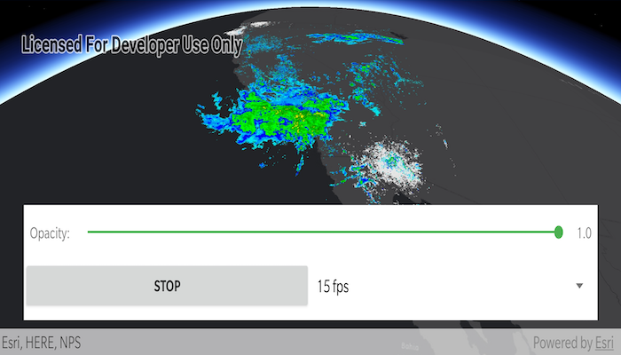

# Animate images with image overlay

Animate a series of images with an image overlay.

## Use case

An image overlay is useful for displaying fast and dynamic images; for example, rendering real-time sensor data captured from a drone. Each frame from the drone becomes a static image which is updated on the fly as the data is made available.

## How to use the sample

The application loads a map of the Southwestern United States. Tap the "Start" or "Stop" button to toggle the radar animation. Use the drop down menu to select how quickly the animation plays. Move the slider to change the opacity of the image overlay.

## How it works

1. Create an `ImageOverlay` and add it to the `SceneView`.
2. Set up a timer with an initial interval time of 67ms, equivalent to ~15fps.
5. Add a new `ImageFrame` to the image overlay at every timer interval.

## Relevant API

* ImageFrame
* ImageOverlay
* SceneView

## About the data

These radar images were captured by the US National Weather Service (NWS). They highlight the Pacific Southwest sector which is made up of part the western United States and Mexico. For more information visit the [National Weather Service](https://www.weather.gov/jetstream/gis) website.

## Offline Data

1. Download the data from [ArcGIS Online](https://runtime.maps.arcgis.com/home/item.html?id=9465e8c02b294c69bdb42de056a23ab1).
2. Open your command prompt and navigate to the folder where you extracted the contents of the data from step 1.
3. Push the data into the scoped storage of the sample app:
`adb push PacificSouthWest /Android/data/com.esri.arcgisruntime.sample.animateimageswithimageoverlay/files/ImageFrames/PacificSouthWest`

## Additional information

The supported image formats are GeoTIFF, TIFF, JPEG, and PNG. `ImageOverlay` does not support the rich processing and rendering capabilities of a `RasterLayer`. Use `Raster` and `RasterLayer` for static image rendering, analysis, and persistence.

## Tags

3d, animation, drone, dynamic, image frame, image overlay, real time, rendering
