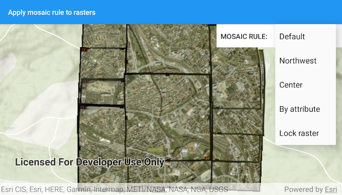

# Apply mosaic rule to rasters

Apply mosaic rule to a mosaic dataset of rasters.

## Use case

An image service can use a mosaic rule to mosaic multiple rasters on-the-fly. A mosaic rule can specify which rasters are selected, and how the selected rasters are z-ordered. It can also specify how overlapping pixels from different rasters at the same location are resolved.

For example, when using the "By Attribute" mosaic method, the values in an attribute field are used to sort the images, and when using the "Center" method, the image closest to the center of the display is positioned as the top image in the mosaic. Additionally, mosaic operation allows you to define how to resolve the overlapping cells, such as choosing a blending operation.

Specifying mosaic rules is useful for viewing overlapping rasters. For example, using the "By Attribute" mosaic method to sort the rasters based on their acquisition date allows the newest image to be on top. Using "mean" mosaic operation makes the overlapping areas contain the mean cell values from all the overlapping rasters.

## How to use the sample

When the rasters are loaded, choose from a list of preset mosaic rules to apply to the rasters.

## How it works

1. Create an `ImageServiceRaster` using the service's URL.
2. Create a `MosaicRule` object and set it to the `mosaicRule` property of the image service raster, if it does not specify a mosaic rule.
3. Create a `RasterLayer` from the image service raster and add it to the map.
4. Set the `mosaicMethod`, `mosaicOperation` and other properties of the mosaic rule object accordingly to specify the rule on the raster dataset.

## Relevant API

* ImageServiceRaster
* MosaicMethod
* MosaicOperation
* MosaicRule

## About the data

This sample uses data from the [Amberg, Germany ImageServer](https://sampleserver7.arcgisonline.com/arcgis/rest/services/amberg_germany/ImageServer) which hosts a mosaic dataset containing several orthophoto TIFF images of Amberg, Germany.

## Additional information

For more information, see [Understanding the mosaicking rules](https://desktop.arcgis.com/en/arcmap/latest/manage-data/raster-and-images/understanding-the-mosaicking-rules-for-a-mosaic-dataset.htm) from *ArcGIS Desktop* documentation. To learn more about how to define certain mosaic rules, see [Mosaic rule objects](https://developers.arcgis.com/documentation/common-data-types/mosaic-rules.htm) from *ArcGIS for Developers*.

## Tags

image service, mosaic rule, mosaic method, raster
