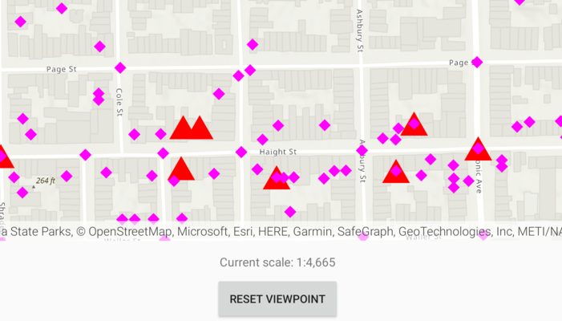

# Apply unique values with alternate symbols

Apply a unique value with alternate symbols at different scales.

## Use case

When a layer is symbolized with unique value symbology, you can specify the visible scale range for each unique value. This is an effective strategy to limit the amount of detailed data at smaller scales without having to make multiple versions of the layer, each with a unique definition query.

Once scale ranges are applied to unique values, you can further refine the appearance of features within those scale ranges by establishing alternate symbols to different parts of the symbol class scale range.

## How to use the sample

Zoom in and out of the map to see alternate symbols at each scale. The symbology changes according to the following scale ranges: 0-5000, 5000-10000, 10000-20000. To go back to the initial viewpoint, tap "Reset Viewpoint".

## How it works

1. Create a `FeatureLayer` using the service url and add it to the map's list of operational layers.
2. Create two alternate symbols (a blue square and a yellow diamond) to be used as alternate symbols. To create an alternate symbol:

    a. Create a symbol using `SimpleMarkerSymbol`.
    
    b. Convert the simple marker symbol to a `MultilayerPointSymbol` using `SimpleMarkerSymbol.toMultilayerSymbol()`.
    
    c. Set the valid scale range through reference properties on the multilayer point symbols blue square and yellow diamond by calling `multilayerPointSymbol.referenceProperties = SymbolReferenceProperties(double minScale, double maxScale)`.
    
3. Create a third multilayer symbol to be used to create a `UniqueValue` class.
4. Create a unique value using the red triangle and the list of alternate symbols.
5. Create a `UniqueValueRenderer` and add the unique value.
6. Create a purple diamond simple marker and convert it to a multilayer symbol to be used as the default symbol.
7. Set the default symbol on the unique value renderer to the purple diamond using `uniqueValueRenderer.defaultSymbol`.
8. Set the `uniqueValueRenderer.fieldNames` on the unique value renderer to "req_type".
9. Apply this unique value renderer to the `featureLayer.renderer`.

## Relevant API

* MultilayerPointSymbol
* SimpleMarkerSymbol
* SymbolReferenceProperties
* UniqueValue
* UniqueValueRenderer

## About the data

The [San Francisco 311 incidents layer](https://sampleserver6.arcgisonline.com/arcgis/rest/services/SF311/FeatureServer/0) in this sample displays point features related to crime incidents such as grafitti and tree damage that have been reported by city residents.

## Tags

alternate symbols, multilayer symbol, scale based rendering, simple marker symbol, symbol reference properties, symbology, unique value, unique value renderer