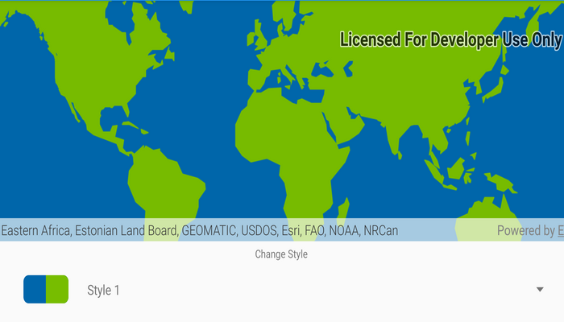

# ArcGIS vector tiled layer (custom style)

Load ArcGIS vector tiled layers using custom styles.

## Use case

Vector tile basemaps can be created in ArcGIS Pro and published as offline packages or online services. You can create a custom style tailored to your needs and easily apply them to your map. `ArcGISVectorTiledLayer` has many advantages over traditional raster based basemaps (`ArcGISTiledLayer`), including smooth scaling between different screen DPIs, smaller package sizes, and the ability to rotate symbols and labels dynamically.

## How to use the sample

Pan and zoom to explore the vector tile basemap. Select a theme to see it applied to the vector tile basemap.

## How it works

1. Construct an `ArcGISVectorTiledLayer` with the URL of a custom style from AGOL.
2. Alternatively, construct an `ArcGISVectorTiledLayer` by taking a portal item offline and apply it to an offline vector tile package:     
    i. Create an `PortalItem` using the URL of a custom style.  
    ii. Create an `ExportVectorTilesTask` using the portal item.  
    iii. Get the `ExportVectorTilesJob` using `ExportVectorTilesTask.exportStyleResourceCache(withDownloadDirectory:)`.  
    iv. Start the job using  `ExportVectorTilesJob.start()`.  
    v. Construct an `VectorTileCache` using the name of the local vector tile package.  
    vi. Once the job is complete, construct an `ArcGISVectorTiledLayer` using the vector tile cache and the `ItemResourceCache` from the job's result.  
3. Create a `Basemap` from the `ArcGISVectorTiledLayer`.
4. Assign the `Basemap` to the map's `basemap`.

## Relevant API

* ArcGISVectorTiledLayer
* ExportVectorTilesTask
* ItemResourceCache
* VectorTileCache

## Offline data
1. Download the data from [ArcGIS Online](https://arcgisruntime.maps.arcgis.com/home/item.html?id=f4b742a57af344988b02227e2824ca5f).
1. Open your command prompt and navigate to the folder where you extracted the contents of the data from step 1.
1. Execute the following command:
`adb push dodge_city.vtpk /Android/data/com.esri.arcgisruntime.sample.arcgisvectortiledlayercustomstyle/files/dodge_city.vtpk`

Link             |  Local Location
:-------------------------:|:-------------------------:
|[Dodge City VTPK](https://arcgisruntime.maps.arcgis.com/home/item.html?id=f4b742a57af344988b02227e2824ca5f)  |  `<sdcard>`/Android/data/com.esri.arcgisruntime.sample.arcgisvectortiledlayercustomstyle/files/dodge_city.vtpk

## Tags

tiles, vector, vector basemap, vector tile package, vector tiled layer, vector tiles, vtpk
