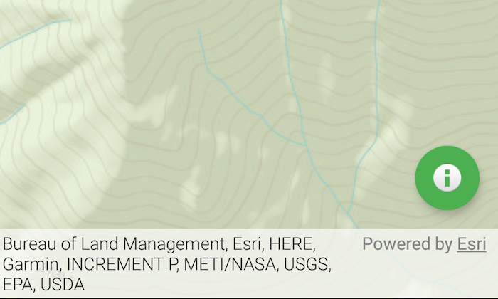

# Attribution view change

Make UI elements respond to changes in the attribution view.

## Use case

ArcGIS Online basemaps, Esri data services, or Esri API technology used in an application require inclusion of an Esri attribution. Depending on its content, the attribution bar may be expandible and collapsible. In this case, expanding the attribution bar may obstruct some of the user interface in the application. To avoid this, the developer may want to make some of the UI elements reposition when the attribution bar is interacted with.

## How to use the sample

Tap the attribution bar to expand it, and observe how the floating action button moves up. Tap the attribution bar again to minimize it and see how the floating action button moves down.

## How it works

1. Add a layout change listener to the `MapView` with `addAttributionViewLayoutChangeListener`.
2. Get the difference in pixels by using `heightDelta = oldBottom - bottom`.
3. Move the floating action button along the MapView by using Android's `CoordinateLayout.layoutParams` and setting it to `heightDelta`.

## Relevant API

* MapView

## Additional information

For more information, see [Attribution in your app](https://developers.arcgis.com/terms/attribution/).

## Tags

translation, UI, user interface
