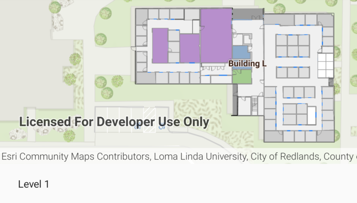

# Browse building floors

Display building floors using a floor-aware web map.

## Use case

Floor-aware maps are useful to browse to floor-aware data based on the configured sites, facilities, and floors layers.

## How to use the sample
Use the floor filter to filter between the floor levels in the facility.

## How it works

1. Create a `PortalItem` using the `itemId` of the floor-aware web map.
2. Set the `MapView` to display the `PortalItem`.
3. Wait for the map to load using the `Map.addDoneLoadingListener`.
4. Retrieve the map's floor manager from `MapView.Map.FloorManager`. Then run `FloorManager.loadAsync()`.
5. Wait for the floor manager to load using `FloorManager.addDoneLoadingListener`  to retrieve the floor-aware data.
6. Set all floors to not visible `FloorManager.levels[floor-number].isVisible = false`.
7. Display only the selected floor to visible using `FloorManager.levels[floor-number].isVisible = true`. **Note:** Set the floor level to the first floor manually by default.

## Relevant API

- FloorManager
- ArcGISMap
- Portal
- PortalItem

## About the data

This sample uses a [floor-aware web map](https://www.arcgis.com/home/item.html?id=f133a698536f44c8884ad81f80b6cfc7) that displays the floors of Building L of ESRI campus at Redlands, CA.  

## Tags
