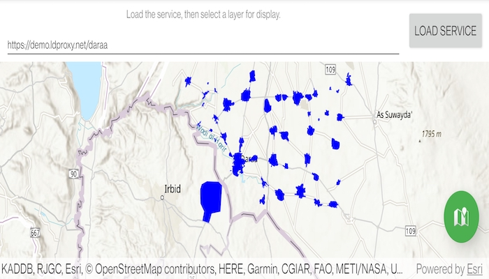

# Browse OGC API feature service

Browse an OGC API feature service for layers and add them to the map.

## Use case

OGC API standards are used for sharing geospatial data on the web. As an open standard, the OGC API aims to improve access to geospatial or location information and could be a good choice for sharing data internationally or between organizations. That data could be of any type, including, for example, transportation layers shared between government organizations and private businesses.

## How to use the sample

Select a layer to display from the list of layers shown in an OGC API service.

## How it works

1. Create an `OgcFeatureService` object with a URL to an OGC API feature service.
2. Obtain the `OgcFeatureServiceInfo` from `OgcFeatureService.serviceInfo`.
3. Create a list of feature collections from the `OgcFeatureServiceInfo.featureCollectionInfos`
4. When a feature collection is selected, create an `OgcFeatureCollectionTable` from the `OgcFeatureCollectionInfo`.
5. Populate the `OgcFeatureCollectionTable` using `populateFromServiceAsync(...)` with `QueryParameters` that contain a `maxFeatures` property.
6. Create a feature layer from the feature table.
7. Add the feature layer to the map.

## Relevant API

* OgcFeatureCollectionInfo
* OgcFeatureCollectionTable
* OgcFeatureService
* OgcFeatureServiceInfo

## About the data

The [Daraa, Syria test data](https://services.interactive-instruments.de/t15/daraa) is OpenStreetMap data converted to the Topographic Data Store schema of NGA.

## Additional information

See the [OGC API website](https://ogcapi.ogc.org/) for more information on the OGC API family of standards.

## Tags

browse, catalog, feature, layers, OGC, OGC API, service, web
