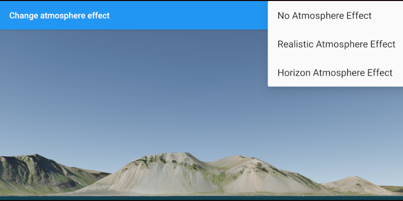

# Change atmosphere effect
Change the appearance of the atmosphere in a scene.

## Use case

Atmospheric effect can be used to make the scene view look more realistic.

## How to use the sample

Select one of the three available atmosphere effects. The sky will change to display the selected atmosphere effect. 

## How it works
To change the atmosphere effect:

1. Create an `ArcGISScene` and display it in a `SceneView`.
2. Change the atmosphere effect with `sceneView.atmosphereEffect(AtmosphereEffect)`.

## Relevant API

* ArcGISScene
* AtmosphereEffect
* SceneView

## Additional information
There are three atmosphere effect options:

- **REALISTIC** - A realistic atmosphere effect is applied over the entire surface.
- **HORIZON_ONLY** - Atmosphere effect applied to the sky (horizon) only.
- **NONE** - No atmosphere effect. The sky is rendered black with a starfield consisting of randomly placed white dots.

#### Tags
atmosphere
