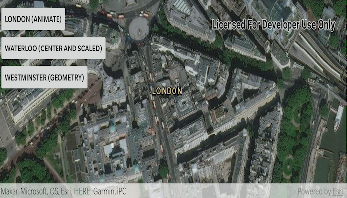

# Change viewpoint

Set the map view to a new viewpoint.

## Use case

Programmatically navigate to a specified location in the map or scene. Use this to focus on a particular point or area of interest.

## How to use the sample

Select a viewpoint option to see the map view move to that location.

## How it works

1. Create a new `ArcGISMap` object and set it to the `MapView` object.
2. Change the map's `Viewpoint` using one of the available methods:
   * Use `MapView.setViewpointAsync(...)` to pan to a viewpoint over the specified length of time.
   * Use `MapView.setViewpointCenterAsync(...)` to center the viewpoint on a `Point` and set a distance from the ground using a scale.
   * Use `MapView.setViewpointGeometryAsync(...)` to set the viewpoint to a given `Geometry`.

## Relevant API

* ArcGISMap
* Geometry
* MapView
* Point
* Viewpoint

## Additional information

Below are some other ways to set a viewpoint:

* setViewpoint(...)
* setViewpointAsync(...)
* setViewpointCenterAsync(...)
* setViewpointGeometryAsync(...)
* setViewpointRotationAsync(...)
* setViewpointScaleAsync(...)

## Tags

animate, extent, pan, rotate, scale, view, zoom
