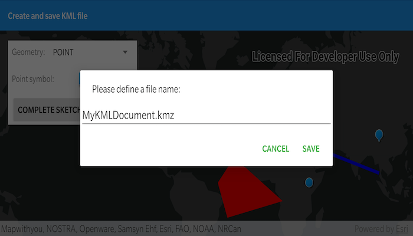

# Create and save KML file

Construct a KML document and save it as a KMZ file.

## Use case

If you need to create and save data on the fly, you can use KML to create points, lines, and polygons by sketching on the map, customizing the style, and serializing them as KML nodes in a KML Document. Once complete, you can share the KML data with others that are using a KML reading application, such as ArcGIS Earth.

## How to use the sample

Click on the map to add the type of geometry selected in the spinner. Click the "Complete Sketch" button to add the geometry to the KML document as a new KML placemark. When you are finished adding KML nodes, click on the "Save KMZ file" button to save the active KML document as a .kmz file on your system.

## How it works

1. Create a `KmlDocument`
2. Create a `KmlDataset` using the `KmlDocument`.
3. Create a `KmlLayer` using the `KmlDataset` and add it to the map's operational layers.
4. Create `Geometry` using the `SketchEditor`.
5. Project that `Geometry` to WGS84 using `GeometryEngine.project(...)`.
6. Create a `KmlGeometry` object using the projected `Geometry`.
7. Create a `KmlPlacemark` using the `KmlGeometry`.
8. Add the `KmlPlacemark` to the `KmlDocument`.
9. Set a `KmlStyle` for the `KmlPlacemark`.
10. When finished with adding `KmlPlacemark` nodes to the `KmlDocument`, save the `KmlDocument` to a file using the `saveAsAsync` method.

## Relevant API

* GeometryEngine.project
* KmlDataset
* KmlDocument
* KmlGeometry
* KmlLayer
* KmlNode.saveAsASync
* KmlPlacemark
* KmlStyle
* SketchEditor

## Tags
Edit and Manage data
Keyhole
KML
KMZ
OGC
